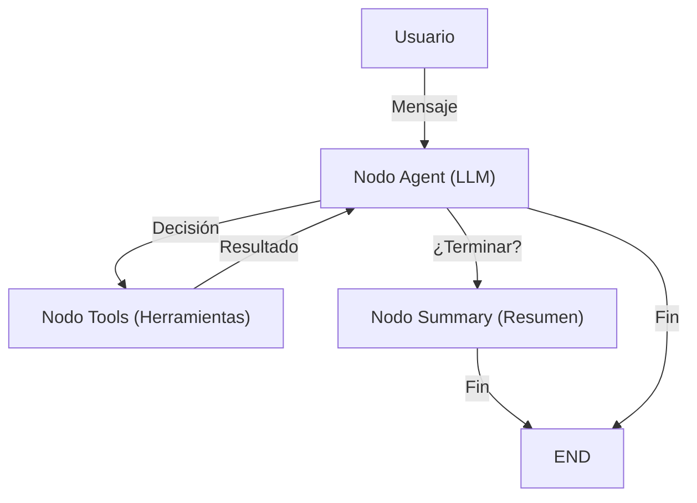

# LangGraph Customer Support Chatbot

> **Ejercicio realizado por la consultora [DSInteg](https://dsinteg.com) basado en el tutorial oficial de LangGraph [Build a Customer Support Bot](https://langchain-ai.github.io/langgraph/tutorials/customer-support/customer-support/).**

---

## 🌐 Síguenos en nuestras redes sociales

[](https://www.linkedin.com/company/dsinteg)
[](https://x.com/dsinteg)

---

## 📋 Características

- **Chatbot inteligente** con capacidades de soporte al cliente
- **Herramientas integradas** para búsqueda de información, verificación de pedidos y creación de tickets
- **Flujo de conversación avanzado** con gestión de estado
- **Resumen automático** de conversaciones
- **Manejo de errores** robusto

## 🏗️ Resumen Visual del Flujo



## 🛠️ Instalación

1. **Clonar el repositorio:**
```bash
git clone <repository-url>
cd test-bot
```

2. **Instalar dependencias:**
```bash
pip install -r requirements.txt
```

3. **Configurar variables de entorno:**
Crear un archivo `.env` en la raíz del proyecto:
```env
OPENAI_API_KEY=tu_api_key_de_openai_aqui
```

## 🚀 Uso

### Versión Básica
```bash
python customer_support_bot.py
```

### Versión Avanzada
```bash
python advanced_customer_support.py
```

## 📚 Ejemplos de Uso

### Preguntas sobre Políticas
```
👤 You: What is your return policy?
🤖 Assistant: Our return policy allows returns within 30 days of purchase with original receipt. Items must be in original condition.
```

### Verificación de Pedidos
```
👤 You: Can you check the status of my order? The order number is 123456789
🤖 Assistant: Order 123456789: Your order is being processed and will ship within 2-3 business days.
```

### Información de Envío
```
👤 You: How long does shipping take?
🤖 Assistant: Standard shipping takes 3-5 business days. Express shipping (1-2 days) is available for $15.99. Free shipping on orders over $50.
```

### Creación de Tickets
```
👤 You: I have a complex issue with my account that I can't resolve
🤖 Assistant: I'll create a support ticket for you. What's your email address and can you describe the issue?
```

## 🏗️ Arquitectura

### Componentes Principales

1. **StateGraph**: Define el flujo de la conversación
2. **Tools**: Herramientas para interactuar con sistemas externos
3. **LLM**: Modelo de lenguaje para generar respuestas
4. **ToolExecutor**: Ejecuta las herramientas cuando es necesario

### Flujo de Trabajo

```
Usuario → LLM → Decisión → Herramientas → LLM → Respuesta
```

### Herramientas Disponibles

- **search_knowledge_base**: Busca información en la base de conocimientos
- **check_order_status**: Verifica el estado de un pedido
- **create_support_ticket**: Crea tickets de soporte
- **get_customer_info**: Obtiene información del cliente

## 🔧 Personalización

### Agregar Nuevas Herramientas

```python
@tool
def nueva_herramienta(parametro: str) -> str:
    """Descripción de la nueva herramienta."""
    # Implementación de la herramienta
    return "Resultado de la herramienta"
```

### Modificar el Conocimiento Base

Edita el diccionario `knowledge_base` en la función `search_knowledge_base`:

```python
knowledge_base = {
    "nuevo_tema": "Información sobre el nuevo tema",
    # ... más entradas
}
```

### Cambiar el Modelo de LLM

Modifica la inicialización del LLM:

```python
llm = ChatOpenAI(
    model="gpt-4",  # Cambiar modelo
    temperature=0.1,  # Ajustar temperatura
    api_key=os.getenv("OPENAI_API_KEY")
)
```

## 📊 Diferencias entre Versiones

| Característica | Básica | Avanzada |
|----------------|--------|----------|
| Gestión de estado | Simple | Compleja |
| Herramientas | 3 | 4 |
| Resumen de conversación | No | Sí |
| Manejo de errores | Básico | Avanzado |
| Interfaz de usuario | Simple | Mejorada |

## 🧪 Pruebas

### Casos de Prueba Sugeridos

1. **Preguntas básicas de política**
2. **Verificación de pedidos válidos e inválidos**
3. **Creación de tickets de soporte**
4. **Finalización de conversación**
5. **Manejo de errores**

### Ejecutar Pruebas

```bash
# Ejemplo de conversación de prueba
python -c "
from advanced_customer_support import app
from langchain_core.messages import HumanMessage

state = {'messages': [HumanMessage(content='What is your return policy?')]}
result = app.invoke(state)
print(result['messages'][-1].content)
"
```

## 🔍 Solución de Problemas

### Error: API Key no encontrada
```
❌ Error: OPENAI_API_KEY environment variable not set.
```
**Solución**: Crear archivo `.env` con tu API key de OpenAI.

### Error: Dependencias faltantes
```
ModuleNotFoundError: No module named 'langgraph'
```
**Solución**: Instalar dependencias con `pip install -r requirements.txt`.

### Error: Modelo no disponible
```
openai.BadRequestError: The model `gpt-3.5-turbo` does not exist
```
**Solución**: Verificar que el modelo especificado esté disponible en tu cuenta de OpenAI.

## 📈 Mejoras Futuras

- [ ] Integración con base de datos real
- [ ] Autenticación de usuarios
- [ ] Historial de conversaciones
- [ ] Análisis de sentimientos
- [ ] Integración con CRM
- [ ] Soporte multiidioma
- [ ] Interfaz web

## 📄 Licencia

Este proyecto está bajo la Licencia MIT. Ver el archivo `LICENSE` para más detalles.

## 🤝 Contribuciones

Las contribuciones son bienvenidas. Por favor, abre un issue o pull request para sugerir mejoras.

## 📞 Soporte

Para soporte técnico o preguntas sobre el proyecto, contacta:
- Email: academy@dsinteg.com
- Issues: GitHub Issues

---

**Nota**: Este proyecto es una implementación educativa realizada por DSInteg, basada en el tutorial oficial de LangGraph. Para uso en producción, considera implementar medidas de seguridad adicionales y conectores a sistemas reales. 